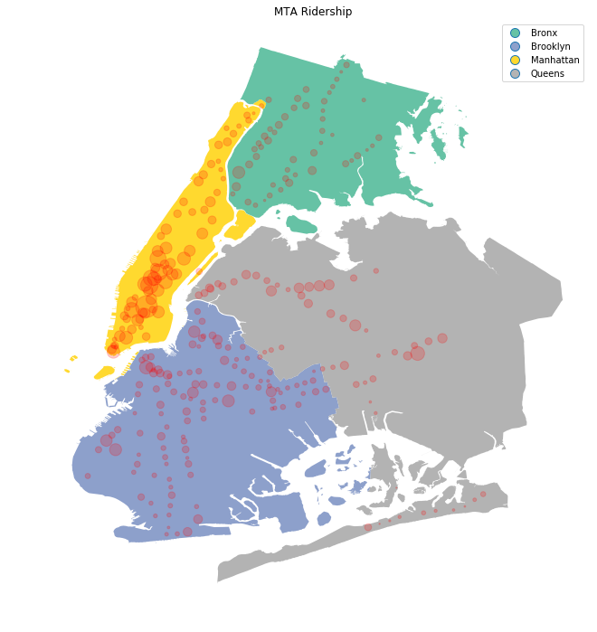

# Intro to Data Science
#### *by Kyoosik Kim*

### Object
This repository is a part of the coursework 'EDA with R' of Udacity. It is created for saving files and codes and for sharing ideas. For that reason, the best way to utilize this repository is to refer to the content, not to copy and paste it. Especially, the project is solely created and owned by the author who reserves all the rights.

### Content
The course starts with basic python syntax and relevant libraries such as numpy and pandas. And then it touches on other data science features like wrangling, visualization, and analysis. I have not ordered the folders with numbers, but with each subject. If you are interested in forking the code snippets but new to python, you can find awesome tutorial [here](https://www.youtube.com/watch?v=Z1Yd7upQsXY&index=1&list=PLBZBJbE_rGRWeh5mIBhD-hhDwSEDxogDg). Next, you can try playing around other domains like visualization and analysis.

### Mini Project
This is basically a data visualization project. The goal is to visualize MTA ridership in terms of popularity of respective stations. I heavily utilized geographical data with help of libraries like 'geopandas'. Some findings are that Manhattan is very busy and that Manhattan is not the only one that has busy stations. More detail can be found by visiting the ['Mini project'](https://github.com/Q-shick/Intro-to-Data-Science/blob/master/Mini%20Project.ipynb) folder.

